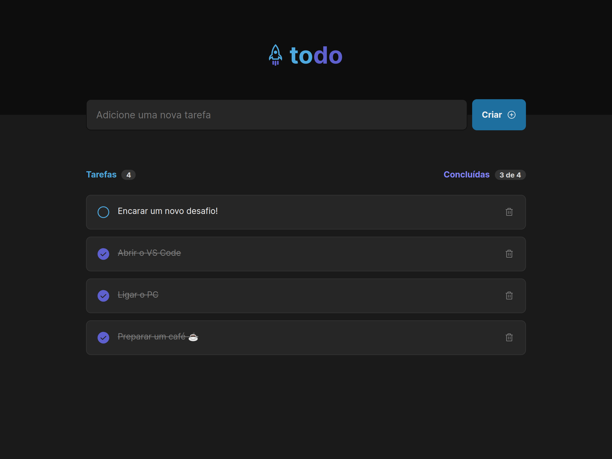
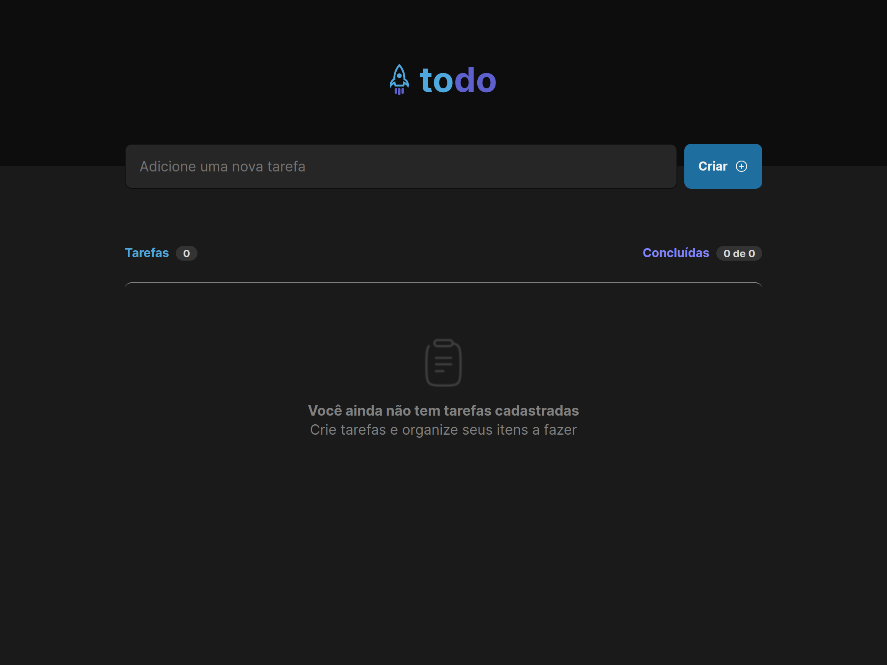

# 🚀 todo

## Primeiro desafio de código!

Projeto desenvolvido durante a **Especialização no desenvolvimento Front-end** na [Rocketseat](https://www.rocketseat.com.br/).

## Sobre o projeto

Aplicação desenvolvida com o mais puro e direto contato com o ReactJs e TypeScript abordando sobre componentização, propriedades, imutabilidade, estados, hooks, css modules e utilizando (sobre pacotes externos) apenas uma biblioteca de ícones e o extra: vesionamento de código com o Git.

## Funcionalidades

Nesta aplicação pode-se adicionar, marcar como concluídas e remover atividades da lista. A mesma informa quantas atividades contém na lista e uma progresso exibindo quantas, do total listado, já foram concluídas.

## Techs utilizadas

- [ReactJs](https://pt-br.reactjs.org/)
- [Vite](https://vitejs.dev/)
- [TypeScript](https://www.typescriptlang.org/)
- [Phosphor Icons](https://phosphoricons.com/)
- [Git](https://git-scm.com/)

## Telas da aplicação

- Lista de atividades vazia
  

- Atividades listadas, algumas concluídas e a próxima a ser feita.
  

## On Work

Acesse e teste a aplicação [clicando aqui](https://cipriano-ignite-todo-list.netlify.app/)
